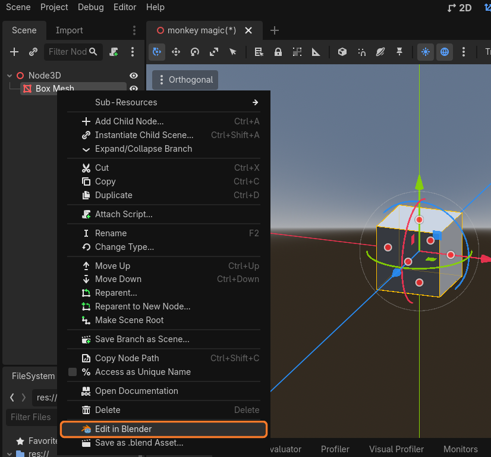
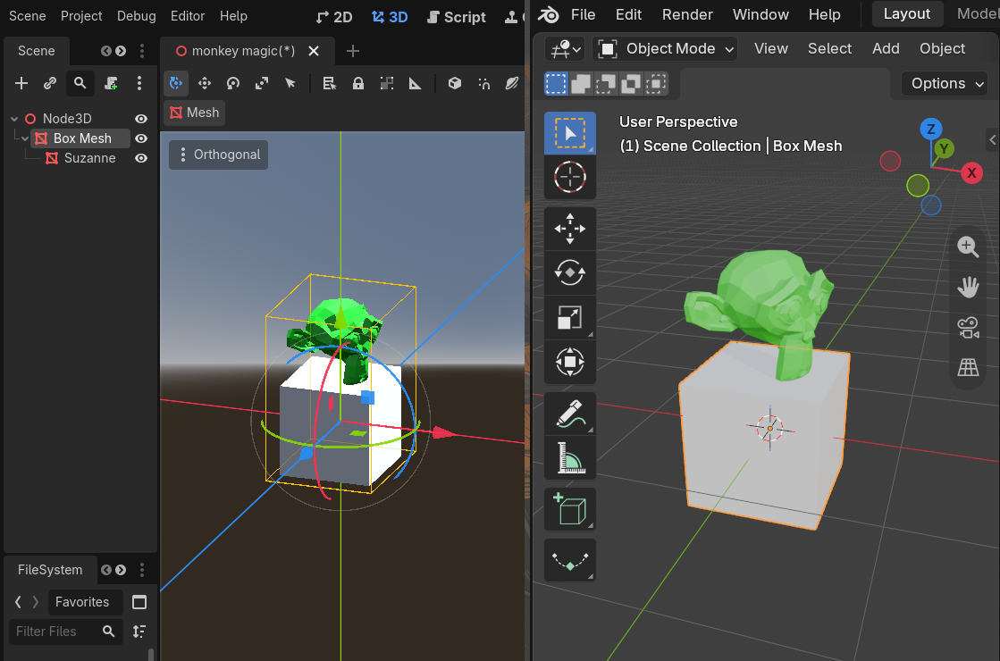
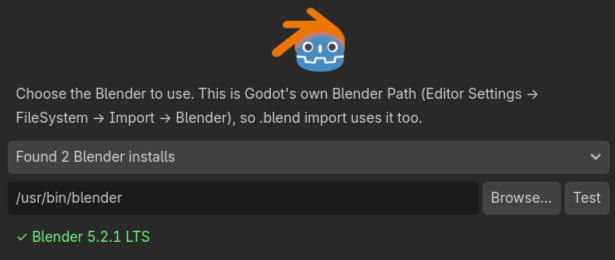

# Blendot

Edit Godot assets in Blender with one click. Save in Blender, and the change shows up back in Godot, in the same place.

- **Model files:** right-click an `.fbx`, `.glb`, `.gltf` or `.obj` and choose **Edit in Blender**. Each Blender save writes the file back, and Godot reimports it.
- **Scene nodes:** right-click a `MeshInstance3D` and choose **Edit in Blender**. Each save updates the node's mesh. Any objects you add in Blender come back as child nodes, keeping their hierarchy and origins, which makes hinged doors and similar parts easy.
- **`.blend` files:** convert a model file or a node into a `.blend` that Godot imports directly. References to it keep working.

Requires **Godot 4.4+** (developed on 4.7) and **Blender 4.2+** (developed on 5.2).

| Right-click → **Edit in Blender** | Save in Blender: new objects come back as child nodes |
|---|---|
|  |  |

## Install

1. Copy `addons/blendot/` into your project.
2. Go to **Project → Project Settings → Plugins** and enable **Blendot**.
3. Go to **Project → Tools → Blendot: Connect Blender…**, pick a detected Blender (or browse to one), and press **Use This Blender**. If Blender isn't connected when you first use Blendot, this dialog opens by itself.

   

Blendot uses Godot's own Blender Path (**Editor Settings → FileSystem → Import → Blender**), so if you've already set that up for `.blend` import, there's nothing to do. On macOS you can pick `Blender.app` directly.

**Godot installed as a Flatpak (Linux):** Blendot starts Blender on the host, which Godot's sandbox blocks by default. Allow it once, then restart Godot:

```bash
flatpak override --user --talk-name=org.freedesktop.Flatpak org.godotengine.Godot
```

Blender itself can be a normal install or a Flatpak. For a Flatpak Blender, pick `org.blender.Blender` from the detected list. Godot's own `.blend` import still can't reach Blender from inside a Flatpak Godot, so use Sidecar mode there rather than Convert.

## Using it

### Model files (FileSystem dock)

Right-click a model file and choose **Edit in Blender**. The same button also appears in the Advanced Import Settings dialog (double-click the file), and in the Scene tree when you right-click a model you've dragged into a scene.

- **Sidecar mode (default):** the first edit creates a `.blend` in `res://.blendot/`. Every save in Blender also exports over the original file, so scenes that use it don't change.
- **Convert to .blend…:** replaces the file with a `.blend` that Godot imports directly. It keeps the file's UID and import settings, so references keep working. The old file goes to the trash. Everyone on the project then needs Blender installed.
- Set **Project Settings → Blendot → Mode** to *Convert* to make **Edit in Blender** always convert first.

If a teammate changed the file since your `.blend` last exported it, Blendot asks whether to rebuild from their version (your `.blend` is kept as `.blend.bak`) or to keep yours.

### Nodes (Scene tree)

Right-click a `MeshInstance3D` and choose **Edit in Blender**.

- Blender's world origin is the node's origin. The node's mesh is the *main* object. Moving it in Blender moves the geometry relative to the origin, which is an easy way to change a mesh's pivot.
- Every other Blender object becomes a child node, keeping Blender's parenting and each object's own origin.
- Renaming, reparenting or deleting objects in Blender updates the same Godot nodes. Scripts and children you added in Godot are kept.
- Godot materials are kept wherever a Blender material has the same name.
- Each Blender save is one undo step in Godot.

**Save as .blend Asset…** turns the node (and its Blender objects) into a `.blend` file and replaces the node with an instance of it. The dialog lets you:

- rename the node after the file;
- see scene references that will be updated (exported properties, animation tracks);
- see script lines that may refer to the node by name. These are listed only, never edited.

### Tools menu

- **Project → Tools → Blendot: Connect Blender…** detects, tests and chooses the Blender to use.
- **Project → Tools → Blendot: Settings…** opens the Blendot project settings.
- **Project → Tools → Blendot: Clean Up Unused Blender Files…** lists `.blend` files and meshes that no scene uses any more, and moves them to the system trash.

## Settings

| Setting | Where | Default |
|---|---|---|
| Blender Path (shared with Godot's `.blend` import) | Editor Settings → FileSystem → Import → Blender, or **Tools → Blendot: Connect Blender…** | `blender` on `PATH` |
| Mode (Sidecar / Convert) | Project Settings → Blendot | Sidecar |
| Sidecar Dir | Project Settings → Blendot | `res://.blendot` |
| Mesh Dir (edited node meshes) | Project Settings → Blendot | `res://blendot_meshes` |
| On External Change (Ask / Use New File / Keep My Blend) | Project Settings → Blendot | Ask |

`res://.blendot/` holds your working `.blend` files and is ignored by Godot's importer. Commit it if your team should share them, or add it to `.gitignore` to keep them per person.

## Good to know

- **Blendot only exports when the edit was started from Godot.** A `.blend` opened directly in Blender is a plain file, and **Save As** to another location never exports.
- **FBX round trips** keep scale, axes, bones, animation names and base-colour textures. Roughness and metallic maps don't survive, because Blender writes them into an FBX slot Godot doesn't read. Use glb, or Godot material overrides, where that matters.
- **Old or text FBX:** Blender can't import FBX older than 7.1, or text (ASCII) FBX. Blendot tells you instead of opening an empty Blender.
- **OBJ** can be edited, but not converted to `.blend`, because Godot imports OBJ as a single mesh, not a scene.
- **Signal connections** on a node aren't moved by **Save as .blend Asset…**. The dialog counts them so you can reconnect them.
- **Raising the Blender window:** on Hyprland, clicking **Edit in Blender** for something already open brings that window to the front. On other desktops, Blendot shows a notice.

## How it works

Godot launches Blender with `addons/blendot/blender/blendot_bridge.py`. The script opens (or creates) the `.blend`, and for that Blender session only, a save handler exports to the Godot asset. The only Blendot data stored in a `.blend` is a small ID on each object (plus a marker on the main object), which lets node edits follow renames. Node edits travel as glTF, the one format both programs read and write natively.

## License

MIT. See [LICENSE](LICENSE).

## Developing Blendot

Clone this repo and open it in Godot: it's a small test project with the addon enabled. Running it opens a launcher that links this clone's `addons/blendot/` into another project, so changes here show up there straight away (Linux and macOS; Windows needs Developer Mode for links). The launcher and `logo/` aren't part of the addon download.
